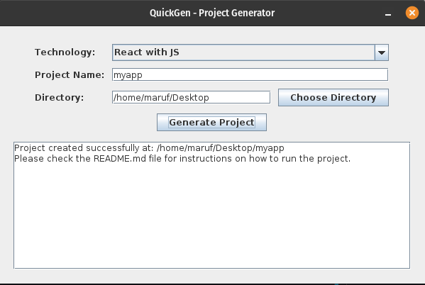

# Project Generator Desktop Application

A powerful desktop application built with Java Swing that helps developers quickly scaffold new projects across multiple technologies through an intuitive graphical interface and socket-based backend.



## Features

- 🚀 Quick project scaffolding for multiple technologies:

  - React with JavaScript
  - React with TypeScript
  - Node.js MVC
  - SCSS templates
  - HTML/CSS projects

- 💻 User-friendly desktop interface built with Java Swing
- 🔄 Real-time project generation through socket communication
- 📁 Custom project location selection
- 📝 Automated README generation for new projects
- 🎯 Pre-configured project templates following best practices

## Prerequisites

Before running the application, ensure you have:

- Java Development Kit (JDK) 8 or higher installed
- Sufficient disk space for project generation
- Network access for socket communication

## Installation

1. Clone the repository:

```bash
 git clone https://github.com/maruf-pfc/QuickGen.git
```

2. Navigate to the project directory:

```shellscript
 cd QuickGen
```

3. Compile the server:

```shellscript
 javac QuickGenServer.java
```

1. Compile the client:

```shellscript
 javac QuickGenClient.java
```

## Usage

1. Start the server:

```shellscript
 java QuickGenServer
```

2. Launch the desktop application:

```shellscript
 java QuickGenClient
```

3. In the application:

1. Select your desired technology
1. Enter a project name
1. Choose a directory for project creation
1. Click "Generate Project"

## Project Structure

```plaintext
📦QuickGen
 ┣ 📂quickgen
 ┃ ┣ 📂opt
 ┃ ┃ ┗ 📂quickgen
 ┃ ┃ ┃ ┣ 📜QuickGen.jar
 ┃ ┃ ┃ ┗ 📜icon.png
 ┃ ┗ 📂usr
 ┃ ┃ ┗ 📂share
 ┃ ┃ ┃ ┗ 📂applications
 ┣ 📂templates
 ┃ ┣ 📂html-css
 ┃ ┣ 📂nodejs-mvc
 ┃ ┣ 📂react-js
 ┃ ┣ 📂react-ts
 ┃ ┗ 📂scss
 ┣ 📜.gitignore
 ┣ 📜LICENSE
 ┣ 📜QuickGen.jar
 ┣ 📜QuickGenClient.java
 ┣ 📜QuickGenServer.java
 ┣ 📜README.md
 ┣ 📜create-deb.js
 ┣ 📜create-exe.js
 ┣ 📜demo.png
 ┣ 📜executable.md
 ┣ 📜launch4j-config.xml
 ┣ 📜manifest.txt
 ┣ 📜setup-launch4j.js
 ┗ 📜setup.js
```

## Make Executable File

- Open this link [Create Executable File](./executable.md)

## Template Structure

Each technology template includes:

- Basic project configuration
- Required dependencies
- Sample components/files
- Development scripts
- Generated README with setup instructions

## Contributing

1. Fork the repository
2. Create your feature branch (`git checkout -b feature/AmazingFeature`)
3. Commit your changes (`git commit -m 'Add some AmazingFeature'`)
4. Push to the branch (`git push origin feature/AmazingFeature`)
5. Open a Pull Request

### Adding New Templates

1. Create a new directory in `templates/` for your technology
2. Include all necessary project files and configurations
3. Update the technology mapping in `QuickGenServer.java`
4. Add template-specific README instructions
5. Submit a pull request with your changes

## Error Handling

The application includes comprehensive error handling for:

- Invalid project names
- Directory access issues
- Network communication errors
- Template missing errors
- Server connection problems

## Development

To modify the application:

1. Update GUI components in `QuickGenClient.java`
2. Modify server logic in `QuickGenServer.java`
3. Add/update templates in the `templates/` directory
4. Recompile both client and server components

## License

This project is licensed under the MIT License - see the [LICENSE](LICENSE) file for details.

## Acknowledgments

- Java Swing for the desktop interface
- Socket programming for client-server communication
- Various project template maintainers
- Open source community

## Support

For support, please:

1. Check existing [Issues](https://github.com/yourusername/project-generator/issues)
2. Create a new issue with detailed information
3. Join our [Discord community](https://discord.gg/projectgenerator)

## Roadmap

- Additional technology templates
- Custom template configuration
- Project dependency updates
- Multi-language support
- Template versioning

## Authors

- **Your Name** - _Initial work_ - [YourUsername](https://github.com/yourusername)

See also the list of [contributors](https://github.com/yourusername/project-generator/contributors) who participated in this project.
